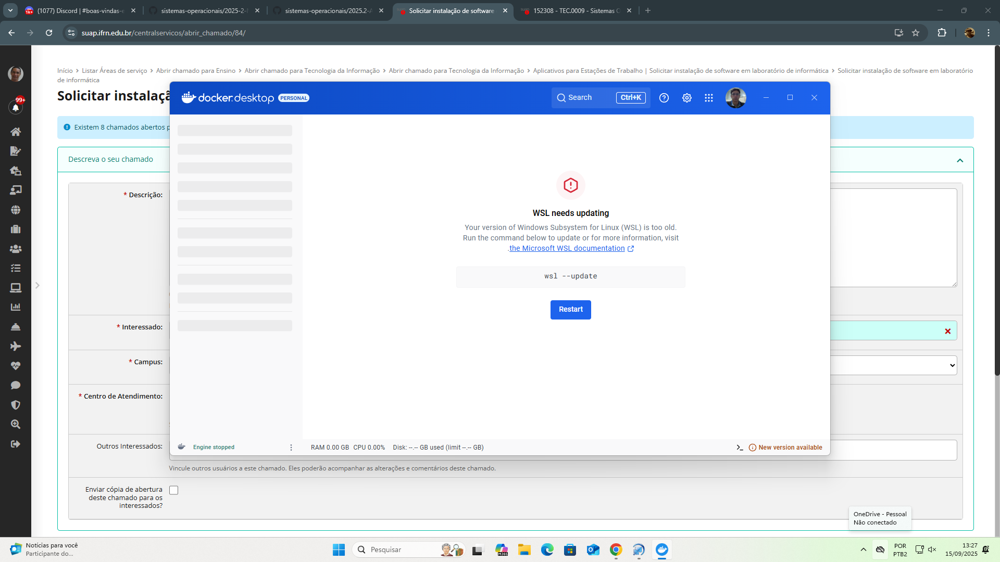

# Relatório de atividade avaliativa de SO

## Informações gerais
- título da atividade
- nome
- data

## Introdução


exemplos



[texto](url)

```
dnf install programa

``` 

```python

def funcao:
    print("texto")
```


## Relato

## Conclusão**

